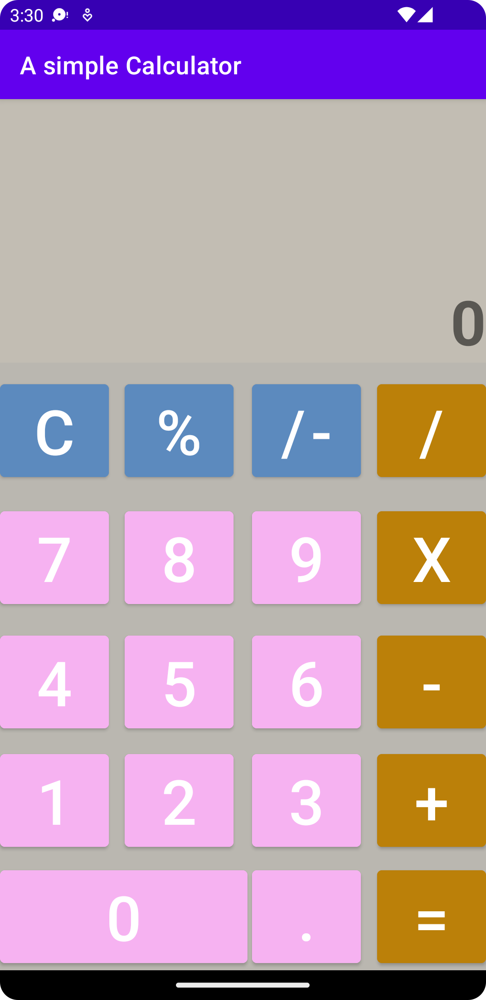

# A Simple Calculator



## Ý tưởng

Dựa vào ý tưởng của app calculator trên MacOS.

## Quá trình hoạt động của App

Người đùng nhập 1 số tiếp theo đó nhập phép toán mong muốn thực hiện (cộng, trừ, nhân, chia, nhị phân,...).
<br>
Ví dụ: Nhập 7 + 3 thì sẽ hiển thị 7 rồi 3. Nếu ta ấn vào dấu bằng thì sẽ hiển thị ra 10. Lúc này nếu ta nhập số thì sẽ coi như một phép toán mới. Còn nếu ta nhập một phép toán thì ta tiếp tục thực hiện phép toán tiếp tục.

## Xử lý vấn đề

Ta xử lý vấn đề bằng 1 biến stage (-1, 0, 1, 2). Ta chỉ thực hiện hàm tính toán khi **stage = 2**. Khi ta ấn dấu bằng thì có nghĩa là **stage = -1**.
<br>
Bây giờ ta sẽ giải thích ý nghĩa của từng stage.
<br>

    -   stage = -1: cho ta biết chương trình vừa chuyển từ từ đấu "=" tới

    -   stage = 0: cho ta biết chương trình đang ở giai đoạn bắt đầu.

    -   stage = 1: cho ta biết đã có đủ 1 số và 1 phép toán

    -   stage = 2: cho ta biết chương trình đã đủ điều kiện để ta có thể thực hiện phép toán

<br>

## Các biến chính

```Java
    private String prevNumber = null;
    private String prevOperator = null;
    private int stage = 0; // Our current stage
    private TextView display, displayOP;
    private Button btn0, btn1, btn2, btn3, btn4, btn5, btn6, btn7, btn8, btn9, btnCom;
    private Button btnAC, btnPlus, btnMinus, btnMul, btnDiv, btnEqual, btnPercent;
    private Button btnSign;

```

## Các hàm chính

- Hàm cập nhật chuỗi (expression)

```Java
    private void update(String exp) {
        // In this case we reset our app
        if (stage == -1) {
            resetApp();
        }

        if (stage == 1) {
            display.setText("0");
            ++stage;
        }
        String text = display.getText().toString();
        if (exp.equals(".")) {
            if (text.indexOf('.') != -1) {
                return;
            }
        }
        text += exp;
        text = validate_input(text);
        display.setText(text);
    }
```

- Hàm xử lý các dạng sai của số

```Java
    private String validate_process(String result) {
        double temp = Double.parseDouble(result);
        if (temp == (int) temp) {
            return String.valueOf((int) temp);
        } else {
            return String.valueOf(temp);
        }
    }

```

```Java
    private String validate_input(String result) {
        int n = result.length();
        for (int i = 0; i < n; ++i) {
            if (result.charAt(i) != '0') {
                return result.charAt(i) == '.' ? result.substring(i - 1, n) : result.substring(i, n);
            }
        }
        return "0";
    }

```

- Hàm này ta cập nhập lại phép toán mới nhập sẽ thực hiện

```Java
    private void updateOperator(String op) {
        // In this case we have our last number
        if (stage == -1) {
            stage = 1;
            prevOperator = op;
            prevNumber = display.getText().toString();
        }
        if (prevNumber == null) {
            ++stage;
            prevNumber = display.getText().toString();
        }
        if (stage == 2) {
            process(prevOperator);
            stage = 1;
        }
        prevOperator = op;
        if (prevOperator != null) {
            displayOP.setText(prevOperator);
        } else {
            displayOP.setText("");
        }
    }
```

```Java
    public void process(String operator) {
        // Our condition to eval the expression
        if (stage != 2) {
            return;
        }
        // Set the stage to -1;
        if (operator.equals("=")) {
            stage = -1;
            displayOP.setText("");
            operator = prevOperator;
        }
        String curr = display.getText().toString();
        double prevAns = Double.parseDouble(prevNumber);
        double currNumber = Double.parseDouble(curr);
        double finalAns = 0;
        if (operator.equals("+")) {
            finalAns = prevAns + currNumber;
        }
        if (operator.equals("-")) {
            finalAns = prevAns - currNumber;
        }
        if (operator.equals("X")) {
            finalAns = prevAns * currNumber;
        }
        if (operator.equals("/")) {
            try  {
                finalAns = prevAns / currNumber;
            } catch (ArithmeticException e) {
                resetApp();
                return;
            }
        }
        // Remember our last number
        prevNumber = validate_process(String.valueOf(finalAns));
        display.setText(validate_process(String.valueOf(finalAns)));
    }
```

## Test thực tế

Ta sẽ thực hiện các phép toán sau: (Lưu ý dây là máy tính dơn giản không có thứ tự ưu tiên giữa các phép toán mà chỉ thực hiện từ trái sang phải)

- 23425 \- 123 \- (-1) \* 0.45 + 123 - 87 = 23302 - (-1) _ 0.45 + 123 - 87
  = 23303 _ 0.45 + 123 - 87 = 10486.35 + 123 - 87 =
  10732.35 - 87 =
  10645.35

- 4 / 0 = Infinity
- 1234 / 134 \* 12345 / 5 = 9.2089 \* 12345 / 5 = 113684.55 / 5 = 22736.91
